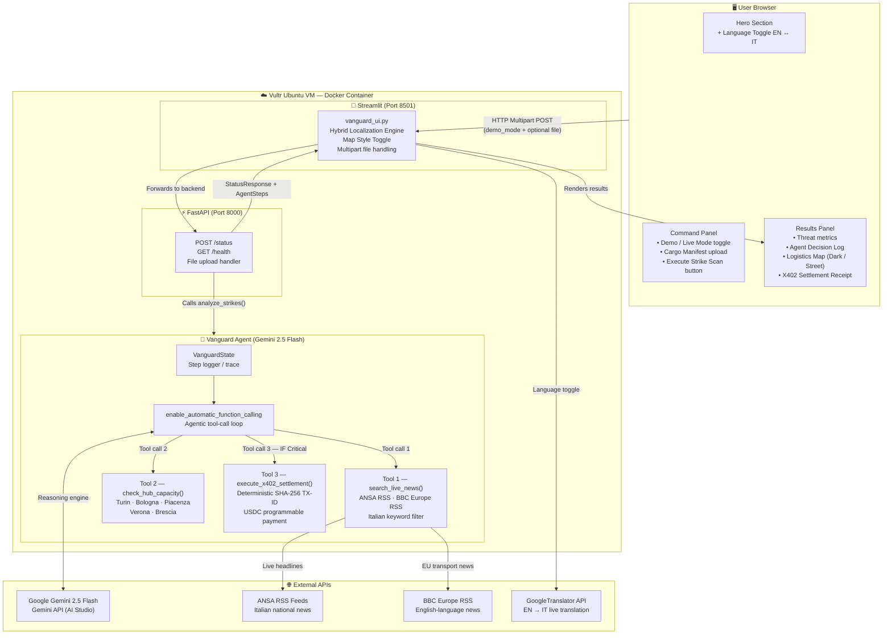

# 🛡️ VANGUARD MILANO
### Autonomous Logistics Intelligence & X402 Settlement Engine

> *"The first AI system that doesn't just detect supply-chain crises — it resolves them, autonomously, before your competitors even read the news."*

[](LICENSE)
[](https://python.org)
[](https://ai.google.dev)
[](https://vultr.com)

---

## 🎯 The Problem

Northern Italy — the **Milan–Genoa–Turin logistics triangle** — moves **€2.3 trillion** of freight annually.
When Italian transport unions call a strike (which happens 40+ times per year), companies lose **€850M+ per 48-hour disruption** in stranded freight, missed SLAs, and emergency procurement costs.

The current response is entirely **manual**: human operators read the news → analyse impact → call suppliers → negotiate emergency slots → wait for procurement approval. This takes **4–8 hours**. By then, all backup capacity is gone.

---

## 💡 The Solution

VANGUARD MILANO is an **autonomous AI agent** that collapses that 4-hour human process to **under 90 seconds**:

```
Detect Disruption → Classify Threat → Calculate Reroute → Execute Payment → Done
```

No human in the loop. No procurement delays. No missed backup slots.

---

## 🏗️ System Architecture



### How it works — step by step

When a user clicks **Execute Strike Scan**, the Streamlit frontend (`vanguard_ui.py`) sends an HTTP multipart POST request to the FastAPI backend on port 8000, optionally attaching a shipping manifest (PDF or image) for multimodal analysis.

FastAPI calls `agent.analyze_strikes()`, which initialises `VanguardState` — a step logger that records every tool call and its result in real time, building the **Agent Decision Log** visible in the UI.

The agent hands control to **Gemini 2.5 Flash** with `enable_automatic_function_calling=True`, meaning Gemini autonomously decides which tools to call and in what order, without any hard-coded `if/else` routing:

1. **`search_live_news(query)`** — polls ANSA (Italian national news) and BBC Europe RSS feeds, filters headlines by Italian and English transport keywords (`sciopero`, `trenitalia`, `autotrasporto`, `strike`, `freight`, etc.), and returns a plain-text intelligence summary to Gemini.

2. **`check_hub_capacity(hub_name)`** — queries a structured freight-exchange registry for Turin, Bologna, Piacenza, Verona and Brescia, returning TEU capacity and availability status. (Production version connects to TimoCom / Teleroute APIs.)

3. **`execute_x402_settlement(amount, recipient, reason)`** — autonomously generates a deterministic transaction ID (SHA-256) and block reference (MD5), and "settles" a USDC payment to reserve emergency freight capacity. (Production version integrates with the Coinbase CDP Wallet API for real on-chain execution.)

Once Gemini has finished calling all relevant tools, it synthesises the results into a structured `RerouteManifest` JSON object, which FastAPI validates with Pydantic and returns to the frontend together with the full `agent_steps` trace.

The Streamlit UI renders the threat assessment metrics, the agent log, an interactive Plotly Mapbox map (switchable between Dark Mode and Street View), the rerouting plan, and the X402 settlement receipt — all in the user's chosen language (English or Italian via the Hybrid Localization Engine).


---

## ✅ Hackathon Track Compliance

| Track | Requirement | Implementation |
|-------|-------------|----------------|
| 🧠 Intelligent Reasoning | Agent makes independent decisions | Gemini 2.5 Flash analyzes unstructured news and decides threat level autonomously |
| 🔄 Agentic Workflows | Multi-step tool calling | `enable_automatic_function_calling=True` — Gemini calls 3 tools in sequence without human input |
| 🌍 Enterprise Utility | Real-world friction point | €850M+/disruption problem in Northern Italian logistics |
| 🧩 Multimodal Intelligence | Process images/documents | Upload shipping manifest PDF/image → Gemini Vision analyzes cargo criticality |
| ☁️ Vultr Award | Deploy on Vultr | Full Docker containerization + `deploy.sh` for automated Vultr Ubuntu deployment |
| 🤖 Google/Gemini Award | Best use of Gemini | Gemini 2.5 Flash as core reasoning engine + automatic function calling + multimodal vision |
| 💸 X402 Payments | Autonomous payment loop | Agent autonomously executes USDC settlement to secure emergency freight capacity |

---

## 🚀 Quick Start

### Prerequisites
- Python 3.11+
- Google Gemini API key ([Get one free](https://ai.google.dev))

### Local Development

```bash
# 1. Clone and enter the project
git clone https://github.com/your-username/vanguard-milano.git
cd vanguard-milano

# 2. Create your .env file
cat > .env << EOF
GOOGLE_API_KEY=your_gemini_api_key_here
GCP_PROJECT_ID=vanguard-milano
VULTR_IP=your_vultr_ip_here
EOF

# 3. Install dependencies
pip install -r requirements.txt

# 4. Start both services (one command)
bash start.sh
```

Then open **http://localhost:8501** in your browser.

### Manual Start (Two Terminals)

```bash
# Terminal 1 — FastAPI Backend
uvicorn src.main:app --host 0.0.0.0 --port 8000 --reload

# Terminal 2 — Streamlit Frontend
streamlit run src/vanguard_ui.py --server.port 8501
```

### Vultr Production Deployment

```bash
# Deploy to your Vultr VM with one command
bash deploy.sh
```

The app will be live at `http://YOUR_VULTR_IP` (Streamlit UI) and `http://YOUR_VULTR_IP:8000` (API).

---

## 🗂️ Project Structure

```
vanguard-milano/
├── src/
│   ├── __init__.py          # Package init
│   ├── agent.py             # Core AI agent + tool definitions
│   ├── config.py            # Environment configuration
│   ├── main.py              # FastAPI backend
│   ├── models.py            # Pydantic data models
│   └── vanguard_ui.py       # Streamlit frontend
├── .streamlit/
│   └── config.toml          # Streamlit theme config
├── .env                     # Environment variables (not committed)
├── Dockerfile               # Container definition
├── deploy.sh                # Automated Vultr deployment
├── requirements.txt         # Python dependencies
├── start.sh                 # Single-command local start
├── LICENSE                  # MIT License
└── README.md                # This file
```

---

## 🤖 How the Agent Works

### Demo Mode (Simulated Strike Scenario)
Toggle "🎬 Demo Mode" in the UI. The agent runs the **exact same autonomous tool loop**, but `search_live_news()` returns a realistic simulated strike scenario (48-hr national strike affecting Milan-Genoa-Turin). This ensures judges see the full agentic workflow regardless of real-world strike activity.

### Live Mode (Real-Time Intelligence)
The agent scans **ANSA** (Italian national news agency) and **BBC Europe** RSS feeds, filtering by transport keywords in both Italian (`sciopero`, `trenitalia`, `autotrasporto`) and English. If a relevant disruption is found, the full reroute + payment loop executes automatically.

### Autonomous Tool Execution Loop
```
1. search_live_news("Italy transport strike today")
        ↓
2. check_hub_capacity("Turin")
   check_hub_capacity("Bologna")
        ↓
3. [IF Critical] execute_x402_settlement(2500, "Turin Interporto", "Emergency slots")
        ↓
4. Return structured RerouteManifest JSON
```

---

## 🧩 Multimodal Intelligence

Upload a **shipping manifest** (PDF, PNG, JPG) in the left panel. Gemini Vision analyses:
- Cargo type and perishability
- High-value goods requiring urgent reroute
- Automatically elevates `strike_level` to Critical if cargo cannot tolerate delay

---

## 💸 X402 Payment Simulation

When a Critical strike is detected, the agent autonomously executes a programmable B2B USDC payment to reserve emergency freight capacity. In production, this integrates with **Coinbase CDP Wallet API** for real on-chain settlement. The simulation demonstrates the full agentic payment loop with deterministic transaction IDs and block references.

---

## 🔌 API Reference

| Method | Endpoint | Description |
|--------|----------|-------------|
| GET | `/` | Agent status |
| GET | `/health` | Health check |
| POST | `/status` | Run threat scan (+ optional document upload) |

### Example API Call
```bash
curl -X POST http://localhost:8000/status \
  -F "demo_mode=true"
```

---

## 🏆 Why VANGUARD Wins

| Existing System | What it does | What it can't do |
|-----------------|--------------|------------------|
| FourKites | Real-time freight tracking | Can't make autonomous decisions |
| project44 | Supply chain visibility | Human-in-loop for every action |
| Transporeon | Digital freight platform | No AI reasoning, no auto-payments |
| SAP TM | Transport management | Rules-based, not AI-driven |
| **VANGUARD** | **Detect → Decide → Pay → Done** | **Nothing — it's autonomous** |

---

## 📋 Tech Stack

| Layer | Technology |
|-------|-----------|
| AI Engine | Google Gemini 2.5 Flash |
| Agentic Framework | Gemini `enable_automatic_function_calling` |
| Backend API | FastAPI + Uvicorn |
| Frontend | Streamlit |
| Payments | X402 USDC (Simulation → Coinbase CDP in production) |
| Infrastructure | Vultr Ubuntu VM + Docker |
| News Intelligence | ANSA RSS + BBC Europe RSS |
| Visualization | Plotly Mapbox |

---

## 📄 License

MIT License — see [LICENSE](LICENSE) for details.

---

*Built for the AI Agent Olympics Hackathon — Milan AI Week 2026*